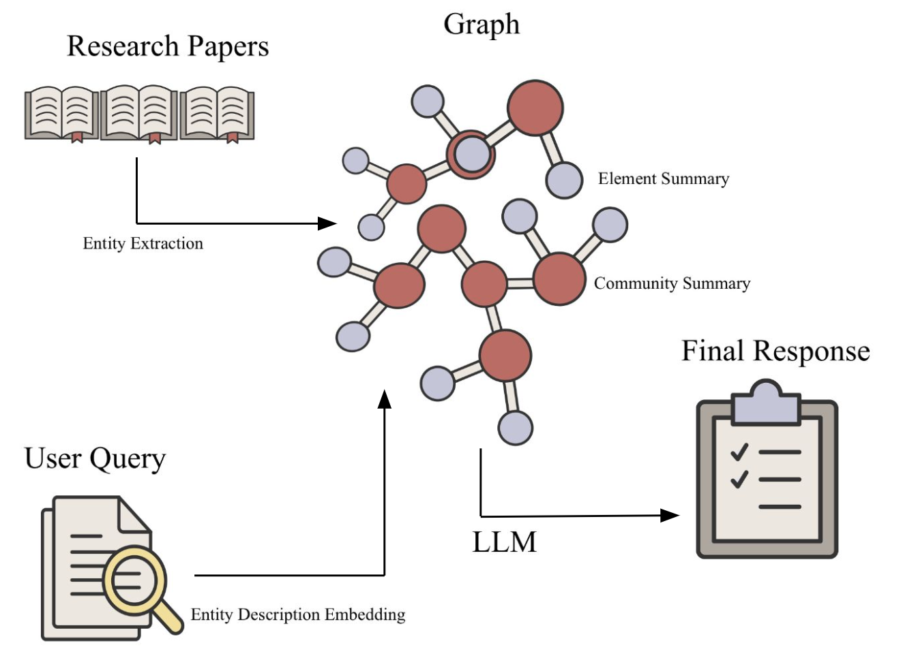

# Medical Question Answering Using GraphRAG

## Table of Contents

1.	[Abstract](#abstract)
2.	[Introduction](#introduction)
3.	[Methods](#methods)

  	3.1 [Dataset](#dataset)
  	
  	3.2 [GraphRAG](#graphrag)

4. [Experiments](#experiments)
5. [Results](#results)
6. [Conclusion](#conclusion)
7. [Contributors](#contributors)

## Abstract

### Introduction

Evidence-based decision-making is crucial for critical care medicine but is a challenge to physicians because of the constant update on new research and guidelines. Recent advancements of implementing Retrieval Augmented Generation (RAG) and Graph Databases in large language models (LLMs) have dramatically increased the capacity of machine-aided question-answering. **This project aims to leverage GraphRAG to answer clinical queries based on updated literature to facilitate clinical decision-making in critical care medicine**.

### Methods
Research papers in ARDS (Acute Respiratory Distress Syndrome) and Sepsis were extracted from Wiki Journal Club. GPT-4o was used for information parsing, and answer generation. Knowledge graphs were constructed using one to five papers associated with ARDS and Sepsis respectively. The papers were added randomly for graph construction but the first paper was always the source document of the medical question being asked. Outputs from the model were recorded on a single run. The generated answers were evaluated using GPT-4o rating, ROUGE-L score, and BLEU score.

### Results

A total of ten papers were extracted for knowledge graph construction. Two clinical questions, associated with ARDS and sepsis, respectively, were used to evaluate the graph-based question-answering model. The average performance of the ARDS and sepsis questions are 0.27 vs 0.87 (GPT rating), 0.06 vs 0.09 (ROUGE-L score), and 0.0 vs 0.03 (BLEU score).

### Conclusion
Our experiments revealed that source consensus strongly affects answer quality, with aligned sources scoring 0.87 and conflicting sources 0.27 on average GPT-4 ratings. To mitigate risks from low-quality answers, we are refining evaluation methods with clinical experts and incorporating metadata like research recency and impact. This solution could transform how physicians access critical medical information, improving efficiency and outcomes.

## Introduction

Making evidence-based clinical decisions has become more and more challenging as guidelines and research papers update best practices consistently. Physicians strive to uphold the oath of "do no harm" in all aspects of their work, whether in the clinic, emergency room, or operating theater. Medicine is not practiced in isolation; rather, teams of physicians from various disciplines often collaborate to devise treatment plans for individual patients. These decisions are often guided by evidence-based medicine, incorporating current research findings and clinical guidelines.
However, physicians face significant challenges in staying up-to-date with the latest clinical guidelines and research, particularly for critical conditions. Reading through extensive texts to understand study populations, methods, clinical presentations, and outcomes is a necessary but time-intensive task. In the modern age of artificial intelligence, vast amounts of data have been utilized to train models, though most medical research is not open-access due to the sensitive nature of patient data.

Transformer-based large language models (LLMs) have demonstrated an increased capacity of machine question answering [1, 2], which has the potential to be applied to provide information for physician decision-making in critical care medicine. However, in the medical domain, the source of information plays a critical role, as different sources could point to contradicting conclusions to the same questions. Moreover, recommended intervention for a given medical condition can evolve as research papers and guidelines are published on a daily basis. To address this issue, Lewis et al. (2020) came up with the idea of retrieval augmented generation (RAG), which asks pre-trained models to give answers based on a source document [3]. Edge et al. (2024) further proposed to use a knowledge graph to represent documents and ask pre-trained models to give answers based on the graph (GraphRAG)[4].

**This project aims to evaluate the potentials for a GraphRAG powered AI chatbot, using a knowledge graph, to practical and relevant literature summaries** for use at the bedside. When queried by a physician, the chatbot will provide detailed responses regarding research methodologies, the alignment of methods to conclusions, and the relevance of the research to the patient being treated. **An example question is; Among patients with septic shock and relative adrenal insufficiency, do corticosteroids reduce 28-day mortality?**

Some research papers tend to agree with the question being asked while some disagree, but ultimately depends on the patient being treated by the physician and which of the study closely aligns to the patient. Ultimately, when physicians consult research guidelines, they seek to understand how closely the study populations align with their current patients and how the research methods could benefit their patients.

## Methods

Retrieval-augmented generation (RAG) enables LLMs to retrieve relevant information from external knowledge sources, allowing them to answer questions more effectively. Traditional RAG systems primarily offer query-focused summarization, which may lead to less comprehensive answers when querying an entire document corpus.

GraphRAG builds upon RAG by leveraging LLMs to construct a graph-based index through a two-stage process. First, it derives an entity knowledge graph from source documents. Then, it pre-generates community summaries for clusters of closely related entities. When a question is asked, each community summary contributes to generating a partial response. These partial responses are subsequently combined into a final, comprehensive answer for the user.

Microsoft has conducted [experiments](https://arxiv.org/abs/2404.16130) comparing standard RAG models with GraphRAG, showing that GraphRAG significantly improves both the comprehensiveness and diversity of generated answers.

## Dataset

Wiki Journal Club (WJC) is an open-source platform similar to Wikipedia, serving as a collaborative resource where medical professionals, primarily internal medicine physicians, contribute concise summaries of landmark clinical trials. These summaries make complex research accessible and understandable for a broad audience. Although WJC is open-source, it provides curated summaries that highlight key aspects of each study, including its purpose, methodology, results, and clinical implications. This structured format allows users to grasp essential information without needing to read the entire study, while the critical appraisal of each study's strengths, limitations, and biases helps users evaluate the quality and relevance of the research.

For this project, we used the full text for data ingestion and indexing. Additionally, we utilized questions posed within Wiki Journal Club entries and the conclusions derived from each full paper to create a well-structured dataset that supports our chatbot’s query-based retrieval and summarization functions.

## GraphRAG

Below is how GraphRAG works:

1. Source documents are separated into chunks of texts.
2. Chunks of texts are parsed to identify entities (e.g. names) and relationships between entities.
3. The parsed entities and descriptions are used to generate a knowledge graph, **nodes** of the graph being the entities.
4. Summaries for nodes and community of nodes are generated.
5. When asking a question, entities in the question are parsed and matched to parts of the knowledge graph.
5. The answer to the question is generated by LLM based on the node and community summaries most relevant to the question.

## Answer Evaluation

The following metrics collectively ensure a comprehensive evaluation of the model's performance, balancing automated similarity measures with expert and GPT-4-based assessments to gauge clinical relevance, reliability, and adherence to medical truth.
* Human Rating: A licensed medical doctor assesses the alignment of the model's generated answers with clinical evidence. Ratings range from 0 (contradictory) to 1 (fully aligned), reflecting the extent to which the response adheres to medical truth and avoids misleading conclusions.

* GPT-4 Rating: Both the ground truth and the model-generated responses are provided to GPT-4 via a carefully crafted prompt. GPT-4 evaluates the alignment of the generated response with the ground truth and assigns a score between 0 (contradictory) and 1 (fully aligned). This method offers a scalable, automated alternative to human evaluation while maintaining a focus on alignment and reliability.
* BLEU Score: The BLEU (Bilingual Evaluation Understudy) score is a widely used metric for evaluating text generation models. It measures the overlap of n-grams (sequences of n words) between the generated answer and the reference answer. A higher BLEU score indicates greater similarity, with a particular emphasis on exact word and phrase matches. While BLEU is effective for tasks requiring strict textual similarity, it may not fully capture nuanced meaning or context, which are critical in medical applications.

* ROUGE-L Score: The ROUGE-L (Recall-Oriented Understudy for Gisting Evaluation) score evaluates the quality of generated responses by assessing the longest common subsequence (LCS) between the generated and reference answers. This metric captures sentence-level similarity and prioritizes recall, making it suitable for tasks where preserving the context and meaning of information is crucial. A higher ROUGE-L score indicates better alignment with the reference in terms of overall structure and content.

## Experiments

Two medical questions regarding Sepsis and ARDS (Acute respiratory distress syndrome, one question for each medical condition) were chosen for the experiment. Each question was based on one source document (research question of a scientific paper). The GraphRAG model was tested under two conditions (aligned and conflicting, detail below) and the **resulting answers were evaluated using** Human Rating, **GPT-4 Rating**, BLEU score and ROUGE-L score. 

1. In the **aligned condition**, documents pointing to **aligned conclusions** were used to construct a knowledge graph. Specifically, we used 1 (source), 3 (source + 1 document with **aligned conclusion** + 1 document with equivocal conclusion regarding the treatment), and 5 (source + 1 document with **aligned conclusion** + 3 documents with equivocal conclusion regarding the treatment) to build the knowledge graph.

2. In the **conflicting condition**, documents pointing to **conflicting conclusions** were used to construct a knowledge graph. Specifically, we used 1 (source), 3 (source + 1 document with **conflicting** conclusion + 1 document related to ARDS but irrelevant to the treatment), and 5 (source + 1 document with **conflicting** conclusion + 3 documents related to ARDS but irrelevant to the treatment) to build the knowledge graph.

## Results

The experiment aimed to evaluate the performance of the GraphRAG model under two conditions—**aligned (widespread consensus)** and **conflicting (no consensus)**—using two medical questions related to **Sepsis** and **ARDS (Acute Respiratory Distress Syndrome)**. The quality of the generated answers was rated by GPT-4 on a scale from 0 (contradictory) to 1 (fully aligned).

1. **Aligned Condition (Widespread Consensus):**
   - In this condition, documents with **aligned conclusions** regarding the medical treatment were incrementally added to the knowledge graph alongside a few documents that failed to provide determinate conclusion.
   - The graph shows that as the number of research papers increases from 1 to 3, **answer quality improves**, starting from 0.8 (1 document) to 0.9 (3 documents), **but plateaus** between 3 and 5 documents.
   - This trend highlights the positive influence of adding aligned and contextually relevant information to the GraphRAG model.

2. **Conflicting Condition (No Consensus):**
   - In this condition, documents with **conflicting conclusions** were added to the knowledge graph, alongside irrelevant or partially related documents.
   - The graph reveals a **steady decline in answer quality** as more documents are introduced. The quality drops from 0.5 (1 document) to 0.2 (3 documents) and eventually to 0.1 (5 documents).
   - This indicates that introducing conflicting or irrelevant information negatively impacts the model's performance, making it harder for the system to resolve contradictions and generate high-quality responses.

**Key Findings:**
- The results demonstrate that the GraphRAG model performs best when additional documents provide aligned and contextually relevant information. With little equivocal documents included, the model can synthesize the data effectively to improve the answer quality. 
- Conversely, conflicting or irrelevant information introduces ambiguity, degrading the model's ability to generate coherent and accurate responses, as seen in the declining performance in the conflicting condition.

These findings underscore the importance of data quality and consensus in constructing knowledge graphs for GraphRAG workflows, especially in fields like medicine, where inconsistent information can heavily impact outcomes. Later in this project, we will test the model's ability on a larger scale of documents and introduce additional metadata into the knowledge graph in an attempt to strengthen the model's reasoning mechanism.

## Conclusion
In conclusion, while GraphRAG provides a significant advancement by enabling globally summarized content with pinned sources, it underscores the critical need for transparency in AI-driven decision-making. Decision-making should not rest solely with the model; instead, the model should focus on presenting the sources it learned from to allow human users to evaluate its outputs. Our findings revealed that conflicting documents confused the model, as it currently weighed all input documents equally, regardless of their credibility or relevance. Additionally, the absence of important metadata, such as citation counts, publication year, or organizational affiliations, limited the model's ability to differentiate authoritative from less reliable sources. Compared to traditional RAG approaches, which rely solely on semantics and similarity, GraphRAG offers enhanced reasoning through graph-based relationships. However, these insights highlight the importance of improving input weighting mechanisms and incorporating richer metadata to ensure more accurate and reliable outputs.

## Detailed Map of the Repo
### [0__Documents](https://github.com/suim-park/Capstone-RAG-Team/tree/main/0__Documents)
- **Documents**: Contains the documents for constructing GraphRAG. We extracted full text of research papers from the Critical Care section of Wiki Journal Club ([Link](https://www.wikijournalclub.org/wiki/WikiJournalClub:Usable_articles#Critical_Care)). To simplify the the code, extracted texts were saved them as .txt files named in the format `doc_*.txt`. 
- **Mapping Document**: The mapping document matches each document’s file name with its original paper title, providing an easy reference for all critical care documents.

### [1__Codes](https://github.com/suim-park/Capstone-RAG-Team/tree/main/1__Codes)
The Codes section encompasses all scripts necessary for the end-to-end workflow, from GraphRAG processing to deployment on Azure. This includes data preprocessing, query handling, and indexing for GraphRAG, as well as configuration and automation for deploying the final model on Azure. Each script is structured to streamline and optimize the setup, allowing for efficient handling of critical care documents, interactive query responses, and scalable deployment.

### [2__Visualization](https://github.com/suim-park/Capstone-RAG-Team/tree/main/2__Visualization)
The Visualizations section includes comprehensive visual aids for understanding the project workflow, from data ingestion to query processing and deployment. It features images illustrating the main interface and interaction flow of the deployed chatbot, highlighting the process and results generated through GraphRAG. Additionally, this section will showcase outcome visuals, such as document summaries and insights derived from the critical care dataset, providing a clear and interactive view of how the chatbot functions and the insights it offers.

### [3__Output](https://github.com/suim-park/Capstone-RAG-Team/tree/main/3__Output)
The Output section presents detailed responses generated in answer to question queries, along with evaluation scores based on various rating methods. Each answer is accompanied by metrics that assess its quality, relevance, and accuracy. These evaluation scores are generated through pre-defined rating methods to provide insight into the chatbot’s performance, the reliability of responses, and areas for improvement. This section enables users to gauge the effectiveness of the model’s answers, ensuring that the system meets quality standards for critical care information delivery.

### [4__Reports_Presentations](https://github.com/suim-park/Capstone-RAG-Team/tree/main/4__Reports_Presentations)
Documentation and presentation materials from the capstone project, including interim and final reports as well as presentations, are uploaded here to chronicle the project’s development and key milestones.

## GraphRAG Walkthrough and Setup Guide
Here's the walkthrough video for GraphRAG: [Watch the video](https://youtu.be/12l63qY2zDQ)

## Contributors
Capstone Github Repository for RAG Team with Duke University School of Medicine

* **Team Name**: RAG Team
* **Executive Sponsor**: Dr. Ian Wong (a.ian.wong@duke.edu)
* **Mentor Instructor**: Dr. Yue Jiang (yue.jiang@duke.edu)
* **Team Member**: [Yun-chung (Murphy) Liu](https://github.com/halfmoonliu), [Keon Nartey](https://github.com/Keonnartey), [Suim Park](https://github.com/suim-park), [Bob Zhang](https://github.com/BobZhang26)

## References
1. Vaswani, A., *et al.* "Attention is all you need." Advances in Neural Information Processing Systems (2017).
2. Brown, Tom B., *et al.* "Language models are few-shot learners." arXiv preprint arXiv:2005.14165 (2020).
3. Lewis, Patrick, *et al.* "Retrieval-augmented generation for knowledge-intensive nlp tasks." Advances in Neural Information Processing Systems 33 (2020): 9459-9474.
4. Edge, Darren, *et al*. "From local to global: A graph rag approach to query-focused summarization." arXiv preprint arXiv:2404.16130 (2024).
