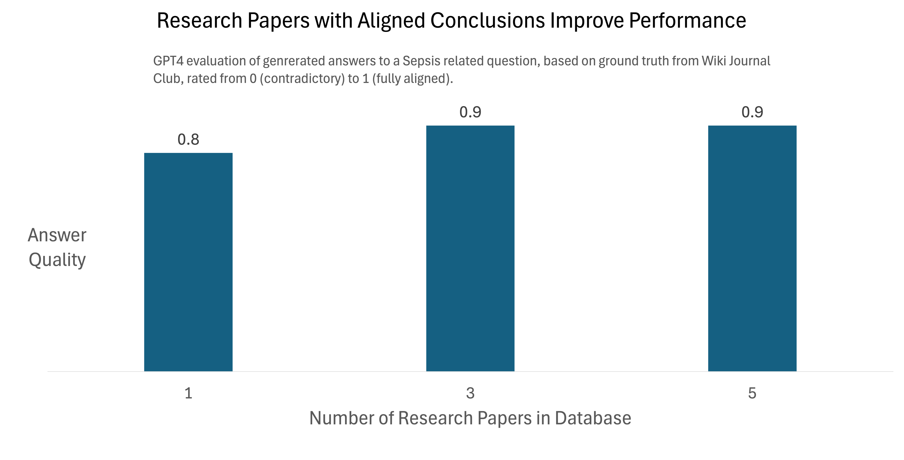
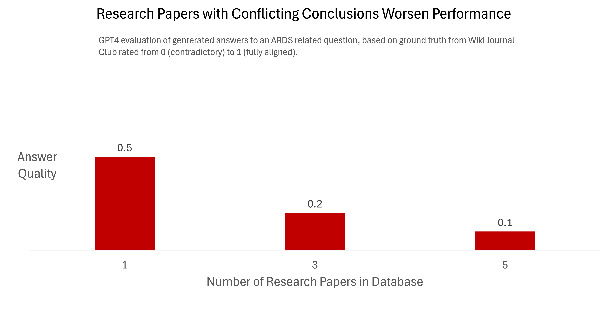

# Capstone-RAG-Team

## Table of Contents

1.	[Abstract](#absract)
2.	Introduction
2.1 Proofpoint 
3.	Methods
3.1 Overview
3.2 Knowledge Distillation
3.3 Anchor Method
3.4 Novel Method 
4.	Experiments
4.1. Experiments: Existing Methods
4.1.1. Experiment setup
4.1.2. Metrics
4.1.3. Models
4.1.4. Results
4.2. Experiments: Novel Method
4.2.1. Experiment setup 
5.	Conclusion
6.	Package
7.	Resources
8.	Contributors

## Abstract

## Project Overview
This project aims to develop and deploy a chatbot for critical care using a GraphRAG-based approach. By storing and indexing published journal articles on critical care, the chatbot will provide responses based on verified sources, ensuring that medical teams access current, reliable information. Leveraging GraphRAG will address many limitations of standard large language models (LLMs) by grounding responses in specific articles, helping to reduce hallucinations, minimize reliance on potentially outdated guidelines, and improve transparency. Furthermore, by sourcing responses directly from the most recent medical literature, the chatbot can offer accurate, up-to-date information while respecting patient privacy and ensuring that all answers are easily verifiable.

## Background

As the number of research papers and guidelines increase, it becomes a tremendous burden for physicians to stay up-to-date to make informed decisions faced with various clinical conditions. The main object for this project is the development of an evidence-based medical question answering model for clinical use.

## Example Question 

Among patients with septic shock and relative adrenal insufficiency, do corticosteroids reduce 28-day mortality?

Some research papers tend to agree with the question being asked whiles some disagree, but ultimately depends on the patient being treated by the physician and which of the study closely aligns to the patient.

## Outline

>- [Dataset](https://www.wikijournalclub.org/wiki/WikiJournalClub:Usable_articles#Critical_Care)
>- The GraphRAG Model
>- Evaluation Metrics
>- A Small GraphRAG Experiment
>- Results
>- Next Steps

## The GraphRag Model

## Experiment

Two medical questions regarding Sepsis and ARDS (Acute respiratory distress syndrome, one question for each medical condition) were chosen for the experiment. Each question was based on one *source document* (research question of a scientific paper). The GraphRAG model was tested under two conditions (*aligned* and *conflicting*, detail below) and the **resulted answers were evaluated** using Human Rating, **GPT-4 Rating**, BLEU score and ROUGE-L score.

1. In the **aligned condition**, documents pointing to **aligned conclusions** were used to construct knowledge graph. Specifically, we used 1 (source), 3 (source + 1 document with **aligned** conclusion + 1 document with equivocal conclusion regarding the treatment), and 5 (source + 1 document with **aligned** conclusion + 3 documents with equivocal conclusion regarding the treatment) to build the knowledge graph. 

2. In the **conflicting condition**, documents pointing to **conflicting conclusions** were used to construct knowledge graph. Specifically, we used 1 (source), 3 (source + 1 document with **conflicting** conclusion + 1 document related to ARDS but irrelevant to the treatment), and 5 (source + 1 document with **conflicting** conclusion + 3 documents related to ARDS but irrelevant to the treatment) to build the knowledge graph. 

## Results

The visualizations illustrate the effects of adding aligned or conflicting research papers on the quality of answers generated by the GraphRAG model for Sepsis and ARDS-related questions. In the **aligned condition** (first graph), even when inconclusive documents are added, the answer quality increases with the number of documents. Conversely, in the **conflicting condition** (second graph), despite starting with a conflicting document and subsequently adding one aligned document plus three equivocal ones, the answer quality continues to decline, highlighting the negative impact of conflicting information on model performance.

## Detailed Map of the Repo
### 0__Documents
- **Documents**: Contains the documents for constructing GraphRAG. We extracted full text of research papers from the Critical Care section of Wiki Journal Club ([Link](https://www.wikijournalclub.org/wiki/WikiJournalClub:Usable_articles#Critical_Care)). To simplify the the code, extracted texts were saved them as .txt files named in the format `doc_*.txt`. 
- **Mapping Document**: The mapping document matches each document’s file name with its original paper title, providing an easy reference for all critical care documents.

### 1__Codes
The Codes section encompasses all scripts necessary for the end-to-end workflow, from GraphRAG processing to deployment on Azure. This includes data preprocessing, query handling, and indexing for GraphRAG, as well as configuration and automation for deploying the final model on Azure. Each script is structured to streamline and optimize the setup, allowing for efficient handling of critical care documents, interactive query responses, and scalable deployment.

### 2__Visualization
The Visualizations section includes comprehensive visual aids for understanding the project workflow, from data ingestion to query processing and deployment. It features images illustrating the main interface and interaction flow of the deployed chatbot, highlighting the process and results generated through GraphRAG. Additionally, this section will showcase outcome visuals, such as document summaries and insights derived from the critical care dataset, providing a clear and interactive view of how the chatbot functions and the insights it offers.

### 3__Output
The Output section presents detailed responses generated in answer to question queries, along with evaluation scores based on various rating methods. Each answer is accompanied by metrics that assess its quality, relevance, and accuracy. These evaluation scores are generated through pre-defined rating methods to provide insight into the chatbot’s performance, the reliability of responses, and areas for improvement. This section enables users to gauge the effectiveness of the model’s answers, ensuring that the system meets quality standards for critical care information delivery.

### 4_Reports_Presentations
Documentation and presentation materials from the capstone project, including interim and final reports as well as presentations, are uploaded here to chronicle the project’s development and key milestones.

Capstone Github Repository for RAG Team with Duke University School of Medicine

* **Team Name**: RAG Team
* **Executive Sponsor**: Dr. Ian Wong (a.ian.wong@duke.edu)
* **Mentor Instructor**: Dr. Yue Jiang (yue.jiang@duke.edu)
* **Team Member**: Yun-chung (Murphy) Liu, Keon Nartey, Suim Park, Bob Zhang
