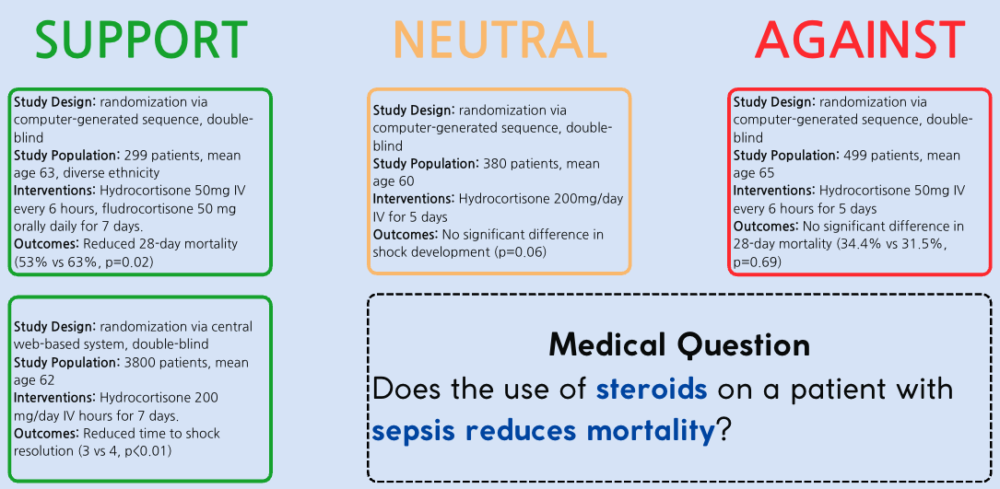
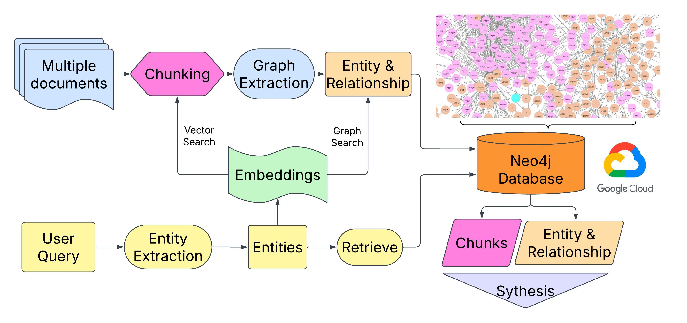

# Knowledge-Graph-Based Medical Question Answering for Critical Care Medicine

## Table of Contents

1.	[Abstract](#abstract)
2.	[Introduction](#introduction)
3.	[Methods](#methods)

  	3.1 [Dataset](#dataset)

	3.2 [Document Representation and Knowledge Graph](#document-representation-and-knowledge-graph)

	3.3 [Retrieval](#retrieval)

	3.4 [Sythesis](#synthesis)

	3.5 [Ground Truth Labels](#ground-truth-labels)
	
  	3.6 [GraphRAG](#graphrag)

4. [Experiments](#experiments)
5. [Results](#results)
6. [Conclusion](#conclusion)
7. [Contributors](#contributors)

## Abstract
Evidence-based clinical decision making is indispensable in critical care medicine. However, the rising amount of published reports in the field has made it more and more difficult to make decisions based on the most appropriate source. This project proposes a **knowledge-graph-based retrieval augmented generation (RAG) model** that can retrieve relevant research papers regarding yes-no medical questions in critical care, grouping the research paper based on the stance to the question, and generate a summary (patient, intervention, comparison, outcome) for each retrieved research paper. Thirty-six yes-no questions related to common medical conditions in critical care (acute respiratory distress syndrome, sepsis, cardiac arrest, delirium) were curated and one hundred twenty research papers were collected (from Wiki Journal Club and PubMed) and annotated by medical doctors to demonstrate the proposed solution. Our model achieved an average **accuracy of 0.925**, **precision of 0.561**, **sensitivity of 0.466**, at research paper retrieval. For knowledge synthesis, Our model achieved an average **accuracy of 0.875** on stance generation and an average human rating of **8/10** on research paper summary. Our proposed solution can dramatically reduce the time needed for research-informed decision making in critical medicine. Further exploration is needed to examine the generalizability of the proposed methods and the paradigm to evaluate generated summaries. 

## Introduction

Making evidence-based clinical decisions has become more and more challenging as guidelines and research papers update best practices consistently. Physicians strive to uphold the oath of "do no harm" in all aspects of their work, whether in the clinic, emergency room, or operating theater. Medicine is not practiced in isolation; rather, teams of physicians from various disciplines often collaborate to devise treatment plans for individual patients. These decisions are often guided by evidence-based medicine, incorporating current research findings and clinical guidelines.
However, physicians face significant challenges in staying up-to-date with the latest clinical guidelines and research, particularly for critical conditions. Reading through extensive texts to understand study populations, methods, clinical presentations, and outcomes is a necessary but time-intensive task. In the modern age of artificial intelligence, vast amounts of data have been utilized to train models, though most medical research is not open-access due to the sensitive nature of patient data.

Transformer-based large language models (LLMs) have demonstrated an increased capacity of machine question answering [1, 2], which has the potential to be applied to provide information for physician decision-making in critical care medicine. However, in the medical domain, the source of information plays a critical role, as different sources could point to contradicting conclusions to the same questions. Moreover, recommended intervention for a given medical condition can evolve as research papers and guidelines are published on a daily basis. To address this issue, Lewis et al. (2020) came up with the idea of retrieval augmented generation (RAG), which asks pre-trained models to give answers based on a source document [3]. Edge et al. (2024) further proposed to use a knowledge graph to represent documents and ask pre-trained models to give answers based on the graph (GraphRAG)[4].

**This project aims to evaluate the potentials for a GraphRAG powered AI chatbot, using a knowledge graph, to practical and relevant literature summaries** for use at the bedside. When queried by a physician, the model will provide detailed responses regarding research methodologies, the alignment of methods to conclusions, and the relevance of the research to the patient being treated. **An example question could be: Does the use of steroids on a patient with sepsis reduces mortality?**

Some research papers tend to agree with the question being asked while some disagree, but ultimately depends on the patient being treated by the physician and which of the study closely aligns to the patient. Ultimately, when physicians consult research guidelines, they seek to understand how closely the study populations align with their current patients and how the research methods could benefit their patients. We adapted the GraphRAG model to retrieve relevant research papers given critical care medical questions, and generate a stance to claims (medical questions in yes-no form), and give factual synthesis using the Patient, Intervention, Comparison, and Outcome (PICO) framework. An example of output format can be seen here:

Our goal is to answer the following questions:
1. Is the graph-based RAG model capable of retrieving relevant research papers documents regarding across medical questions in critical care medicine?
2. Can the graph-based RAG model synthesize factual summaries based on the research papers retrieved?
3. Is the graph-based RAG model able to give consistent results?

## Methods

Retrieval-augmented generation (RAG) enables LLMs to retrieve relevant information from external knowledge sources, allowing them to answer questions more effectively. Traditional RAG systems primarily offer query-focused summarization, which may lead to less comprehensive answers when querying an entire document corpus.

GraphRAG builds upon RAG by leveraging LLMs to construct a graph-based index through a two-stage process. First, it derives an entity knowledge graph from source documents. Then, it pre-generates community summaries for clusters of closely related entities. When a question is asked, each community summary contributes to generating a partial response. These partial responses are subsequently combined into a final, comprehensive answer for the user.

Microsoft has conducted [experiments](https://arxiv.org/abs/2404.16130) comparing standard RAG models with GraphRAG, showing that GraphRAG significantly improves both the comprehensiveness and diversity of generated answers.

### Dataset

A total of one hundred and twenty research papers associated with any medical conditions from WikiJournalClub, PubMed and Google Scholar were collected for model development. 36 yes-no medical questions associated with four medical conditions common in critical care medicine (ARDS, Sepsis, cardiac arrest, and delirium) were curated by three physicians specialized in critical medicine (K.N., M.A. and A.W, with 3, 10, and 20 years of experience respectively, see supplementary Table 1) for model evaluation. 

### Document Representation and Knowledge Graph

For Knowledge Graph Generation, entities are first extracted from user input questions using OpenAI's GPT-4 model. The extracted entities were then transformed into vector representations using the all-MiniLM-L6-v2 model from SentenceTransformer. The model generated embeddings were of dimensionality of 384. Nodes labeled as "Entity" are created as part of the graph structure. These "Entity" nodes, which represent concepts derived from the documents, differ from the entities extracted from user input questions. To support semantic similarity searches, the "Entity" nodes are indexed as vectors with the same dimensionality of 384, aligning with the embeddings of the extracted entities. This dual-entity approach—combined with chunked document storage, automated graph construction, and vector-based indexing—creates a robust and flexible knowledge graph capable of advanced query processing and semantic search.

### Retrieval
To retrieve relevant research papers regarding medical questions, the cosine similarity between the embeddings of chunks of research papers and the medical question being posed was calculated. Source research paper of chunks with the highest cosine similarity scores (using cut points of top n chunks and/ or minimum relevance score) were retrieved to answer the medical question. 

### Synthesis 

Chunk embeddings and information stored in the knowledge graph was used as a prompt for pretrained LLMs (Open AI’s GPT-4o was used) to generate stances of and summaries for retrieved research papers. The following sections were synthesized: stances (supporting, equivocal, or against the claim of the medical question) and the PICO summary of the retrieved research paper (Study Design and Methodology, Study Population,  Interventions, Comparator, Outcomes, Strengths and Weaknesses, Key Findings and Conclusion). 

### Ground Truth Labels

Each research paper was annotated based on two dimensions for each medical question, relevance and stance. For relevance, each research paper was annotated as either relevant (1) or irrelevant (0) to every medical question curated for this study. For stances, each research paper was annotated as supporting (1), neutral (0) or against (-1) the claim of the given medical question. For papers annotated as irrelevant to a given question, the annotation for stance would be neutral (0). The annotation was done by the authors and checked by K.N. (specialized in general medicine with 5 years of experience). 
For paper summaries, we leveraged large language models (specifically, Claude from AWS Bedrock), to generate the following for each paper included: Study Design and Methodology, Study Population, Interventions, Comparator, Outcomes, Strengths and Weaknesses, Key Findings and Conclusion. The generated summaries were modified and proofread by two physicians K.N. and M.A to serve as ground truth for model evaluation.

### GraphRAG

Below is how GraphRAG works:

1. Source documents are separated into chunks of texts.
2. Chunks of texts are parsed to identify entities (e.g. names) and relationships between entities.
3. The parsed entities and descriptions are used to generate a knowledge graph, **nodes** of the graph being the entities.
4. Summaries for nodes and community of nodes are generated.
5. When asking a question, entities in the question are parsed and matched to parts of the knowledge graph.
5. The answer to the question is generated by LLM based on the node and community summaries most relevant to the question.

## Results
A total of 36 medical questions were posed to the model. For each question, the model first retrieved documents from the database based on high semantic similarity. These retrieved documents were then compared to annotated documents using binary metrics. Following retrieval, the model utilized a large language model (`GPT-3.5 Turbo`) to classify the retrieved documents into three stance categories—support, neutral, and against—relative to the question asked. Additionally, the model generated PICO (Population, Intervention, Comparison, Outcome) summaries for each retrieved document in JSON format, enabling users to quickly extract key information from the papers.

Retrieval performance was assessed using recall, precision, F1-score, and overall accuracy, treating the task as a binary classification problem across all included research papers. For stance classification (support, against, neutral), overall accuracy was used to evaluate synthesis performance. PICO summary quality was evaluated using embedding-based and large language model-based metrics, including BERTScore and G-Eval. A subset of 10% of the synthesized answers was further evaluated by physicians (K.N., M.A.) to ensure clinical relevance and accuracy.

## Conclusion
In conclusion, our GraphRAG-based medical question answering system demonstrates significant potential for supporting evidence-based clinical decision-making in critical care medicine. With an average accuracy of 0.925 for document retrieval and 0.875 for stance classification, our model effectively organizes and synthesizes complex medical literature to address specific clinical questions.

While GraphRAG provides a significant advancement by enabling globally summarized content with pinned sources, it underscores the critical need for transparency in AI-driven decision-making. Decision-making should not rest solely with the model; instead, the model should focus on presenting the sources it learned from to allow human users to evaluate its outputs. Our findings revealed that conflicting documents confused the model, as it currently weighed all input documents equally, regardless of their credibility or relevance. Additionally, the absence of important metadata, such as citation counts, publication year, or organizational affiliations, limited the model's ability to differentiate authoritative from less reliable sources.

Compared to traditional RAG approaches, which rely solely on semantics and similarity, GraphRAG offers enhanced reasoning through graph-based relationships. However, these insights highlight the importance of improving input weighting mechanisms and incorporating richer metadata to ensure more accurate and reliable outputs.

The positive evaluation by practicing physicians confirms that our approach can meaningfully reduce the cognitive burden associated with literature review, potentially saving critical time in urgent care settings. Future work should focus on:

1. Incorporating document credibility metrics into the knowledge graph structure
2. Expanding the document corpus to cover more critical care conditions
3. Implementing dynamic knowledge graph updates as new research emerges
4. Developing more nuanced stance classification for cases with mixed evidence
5. Integrating patient-specific factors to further personalize research recommendations

As AI continues to evolve in healthcare applications, systems like ours must balance technological advancement with clinical responsibility, **always positioning the physician as the ultimate decision-maker** while providing them with the most relevant and reliable evidence-based information possible.

## Detailed Map of the Repo
### [0__Documents](https://github.com/suim-park/Capstone-RAG-Team/tree/main/0__Documents)
- **Documents**: Contains the documents for constructing GraphRAG. We extracted full text of research papers from the Critical Care section of Wiki Journal Club ([Link](https://www.wikijournalclub.org/wiki/WikiJournalClub:Usable_articles#Critical_Care)). To simplify the the code, extracted texts were saved them as .txt files named in the format `doc_*.txt`. 
- **Mapping Document**: The mapping document matches each document’s file name with its original paper title, providing an easy reference for all critical care documents.

### [1__Codes](https://github.com/suim-park/Capstone-RAG-Team/tree/main/1__Codes)
The Codes section encompasses all scripts necessary for the end-to-end workflow, from GraphRAG processing to deployment on Azure. This includes data preprocessing, query handling, and indexing for GraphRAG, as well as configuration and automation for deploying the final model on Azure. Each script is structured to streamline and optimize the setup, allowing for efficient handling of critical care documents, interactive query responses, and scalable deployment.

### [2__Visualization](https://github.com/suim-park/Capstone-RAG-Team/tree/main/2__Visualization)
The Visualizations section includes comprehensive visual aids for understanding the project workflow, from data ingestion to query processing and deployment. It features images illustrating the main interface and interaction flow of the deployed chatbot, highlighting the process and results generated through GraphRAG. Additionally, this section will showcase outcome visuals, such as document summaries and insights derived from the critical care dataset, providing a clear and interactive view of how the chatbot functions and the insights it offers.

### [3__Output](https://github.com/suim-park/Capstone-RAG-Team/tree/main/3__Output)
The Output section presents detailed responses generated in answer to question queries, along with evaluation scores based on various rating methods. Each answer is accompanied by metrics that assess its quality, relevance, and accuracy. These evaluation scores are generated through pre-defined rating methods to provide insight into the chatbot’s performance, the reliability of responses, and areas for improvement. This section enables users to gauge the effectiveness of the model’s answers, ensuring that the system meets quality standards for critical care information delivery.

### [4__Reports_Presentations](https://github.com/suim-park/Capstone-RAG-Team/tree/main/4__Reports_Presentations)
Documentation and presentation materials from the capstone project, including interim and final reports as well as presentations, are uploaded here to chronicle the project’s development and key milestones.

## GraphRAG Walkthrough and Setup Guide
Here's the walkthrough video for GraphRAG: [Watch the video](https://youtu.be/12l63qY2zDQ)

## Contributors
Capstone Github Repository for RAG Team with Duke University School of Medicine

* **Team Name**: RAG Team
* **Executive Sponsor**: Dr. Ian Wong (a.ian.wong@duke.edu)
* **Mentor Instructor**: Dr. Yue Jiang (yue.jiang@duke.edu)
* **Team Member**: 
[Bob Zhang](https://github.com/BobZhang26), [Keon Nartey](https://github.com/Keonnartey),
[Yun-chung (Murphy) Liu](https://github.com/halfmoonliu), [Suim Park](https://github.com/suim-park)

## References
1. Vaswani, A., *et al.* "Attention is all you need." Advances in Neural Information Processing Systems (2017).
2. Brown, Tom B., *et al.* "Language models are few-shot learners." arXiv preprint arXiv:2005.14165 (2020).
3. Lewis, Patrick, *et al.* "Retrieval-augmented generation for knowledge-intensive nlp tasks." Advances in Neural Information Processing Systems 33 (2020): 9459-9474.
4. Edge, Darren, *et al*. "From local to global: A graph rag approach to query-focused summarization." arXiv preprint arXiv:2404.16130 (2024).
